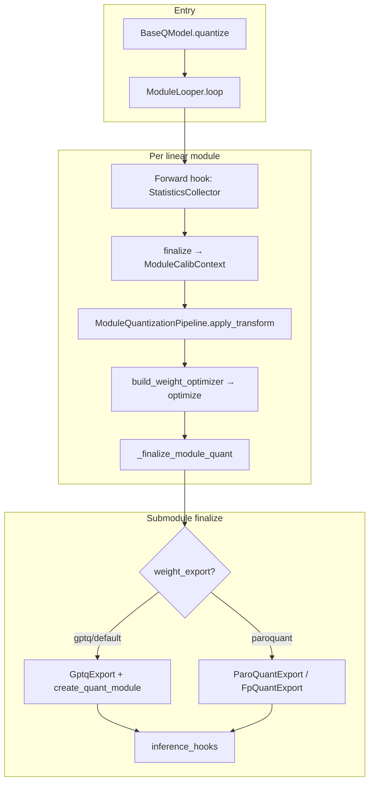

# Modular PTQ Restructure

This document describes how the GPTQModel fork rewired quantization into a composable **three-component PTQ pipeline** while preserving parity for standard standalone GPTQ and ParoQuant runs.

## Motivation

Pre-refactor, GPTQ quantization mixed Hessian capture, optional transforms, and packing inside monolithic looper processors. That made it hard to:

- Compose transforms (random orthogonal, ParoQuant, WUSH) with different quantizers (GPTQ, RTN)
- Validate intermediate states (Hessian, transformed weights) against legacy paths
- Run per-module Chen et al. ordering without redundant full-model passes

The new design splits concerns into registries under `gptqmodel/ptq/` and a single canonical looper entry point: **`SequentialPTQProcessor`**.

## Architecture



### Package layout

| Path | Role |
|------|------|
| `gptqmodel/ptq/pipeline.py` | `ModuleQuantizationPipeline` — stats → transform → quantize for one module |
| `gptqmodel/ptq/stats.py` | `StatisticsCollector` — streaming Hessian / QR factor |
| `gptqmodel/ptq/transforms/` | Transform backends (`identity`, `random_orthogonal`, `paroquant`, …) |
| `gptqmodel/ptq/optimizers/` | Weight optimizers (`gptq`, `rtn`, `paroquant`, …) |
| `gptqmodel/ptq/export/` | Export backends (`gptq`, `paroquant`, …) |
| `gptqmodel/ptq/inference_hooks.py` | Activation pre-hooks and `ptq_t_x_*` checkpoint buffers |
| `gptqmodel/looper/sequential_ptq_processor.py` | **Canonical** looper processor |
| `gptqmodel/looper/processor_args.py` | `build_gpt_quantizer_processors()` wiring |

### State carried between stages

| Key / type | Contents |
|------------|----------|
| `PTQ_STATS_KEY` → `StatisticsCollector` | In-flight Hessian accumulation |
| `PTQ_CONTEXT_KEY` → `ModuleCalibContext` | Finalized H, qr_R, row_buffer, nsamples |
| `PTQ_TRANSFORM_KEY` → `TransformState` | Transform method, payload, inference metadata |
| `WeightQuantState` | pack_weight, scales, zeros after optimize |

## Config surface

Three optional fields on `QuantizeConfig` (normalized in `quantization/config.py`):

### `weight_prepare`

List of transform steps. Each entry is a dict with `method` and transform-specific options.

```python
# Explicit identity (same as omitting weight_prepare for GPTQ)
weight_prepare=[{"method": "identity"}]

# Random orthogonal + GPTQ
weight_prepare=[{
    "method": "random_orthogonal",
    "group_size": 128,
    "opt_seed": 42,
    "inference_precision": "float32",
}]
weight_quantize={"method": "gptq"}
weight_export={"format": "gptq"}

# Modular ParoQuant (full triple)
weight_prepare=[{
    "method": "paroquant",
    "krot": 8,
    "opt_rotation_epochs": 1,
    "opt_finetune_epochs": 0,
}]
weight_quantize={"method": "paroquant"}
weight_export={"format": "paroquant"}
```

### `weight_quantize`

Selects the weight optimizer: `gptq` (default), `rtn`, `paroquant`, `gptaq`, `foem`.

### `weight_export`

Selects packing/runtime: `gptq` (default), `paroquant`, etc.

### Registry aliases

**Transforms:** `identity`/`none`, `paroquant`/`paro`, `random_orthogonal`/`rand_ortho`/`quip_incoherence`

**Optimizers:** `gptq`, `gptaq`, `foem`, `paroquant`/`paro`, `rtn`

## Legacy vs modular mapping

| Goal | Legacy | Modular equivalent |
|------|--------|-------------------|
| Plain GPTQ | `QuantizeConfig(bits=4, group_size=128)` (no `weight_prepare`) | Same, or `weight_prepare=[{"method": "identity"}]` |
| ParoQuant product | `ParoConfig(...)` / `method=METHOD.PARO` → `ParoQuantProcessor` | `weight_prepare/quantize/export=paroquant` on `QuantizeConfig` → `SequentialPTQProcessor` |
| Random orthogonal + GPTQ | N/A (new) | `weight_prepare=random_orthogonal`, `weight_quantize=gptq` |

**Important:** `METHOD.PARO` still routes to **`ParoQuantProcessor`** for grouped/layer-scope Paro optimization. The modular ParoQuant path is the migration target but does not yet replace all ParoQuantProcessor features (e.g. layer-scope grouped AdamW on MoE).

**Deprecated (not wired in production):** `StatisticsProcessor`, `TransformProcessor`, split multi-pass GPTQ, and `GPTQProcessor` inline capture. Replaced by `SequentialPTQProcessor`. `ParoQuantProcessor` remains for grouped/layer-scope Paro optimization until ported to PTQ.

## Inference transforms

Some transforms bake into weights; others require activation pre-hooks at inference.

| Transform | Typical bake | Inference |
|-----------|--------------|-----------|
| identity | yes | none |
| random_orthogonal | weights only | `T_X` applied via pre-hook on activations |
| paroquant | rotation baked or exported | ParoLinear kernel |

Unbaked transforms persist **`ptq_t_x_*` buffers** on modules (`inference_hooks.py`):

- `ptq_t_x_matrices`, `ptq_t_x_block_size`, `ptq_t_x_pad`, `ptq_transform_method_bytes`

These are saved in safetensors and rehydrated on `from_quantized()` load before hooks are registered.

## Parity validation

Standard pipelines must match pre-refactor behavior. Run:

```bash
# Core PTQ unit tests
pytest tests/test_ptq_pipeline.py \
  tests/test_ptq_three_component_refactor.py \
  tests/test_build_gpt_processors.py \
  tests/test_paroquant_transform_parity.py -m "not colab" -q

# Intermediate fingerprint scripts
python scripts/compare_pipeline_intermediates.py
python scripts/compare_paroquant_transform_intermediates.py --rotation-epochs 1 --finetune-epochs 0

# End-to-end smoke
python scripts/quantize_small_model_smoke.py --compare
python scripts/quantize_small_model_smoke.py --pipeline ptq --check-parity
```

Colab gate checklist: `tests/test_ptq_parity_gates_colab.py`.

| Gate | What it checks |
|------|----------------|
| `compare_pipeline_intermediates.py` | H / qr_R from inline GPTQ vs `StatisticsCollector` |
| `test_ptq_cholesky_parity.py` | Legacy inline vs split PTQ on single linear |
| `test_paroquant_transform_parity.py` | Paro transform seeds and optimize kwargs |
| `quantize_small_model_smoke.py --check-parity` | Quantize → save → reload → generate |

## Random orthogonal status

Random orthogonal + GPTQ shows **higher WikiText perplexity** than identity + GPTQ on small Qwen models (under investigation).

Diagnostic tools:

- `scripts/benchmark_random_orthogonal_ppl.py` — PPL comparison with fair damp
- `scripts/diagnose_random_orthogonal_layer.py` — single-module output MSE and hook audit
- `scripts/benchmark_ptq_combinations.py` — prepare × quantize matrix (e.g. paroquant + GPTQ as control)
- `tests/test_random_orthogonal_output_mse.py` — pre-quant matmul invariant regression

**Note:** GPTQ loss `(w−q)²/d²` is in transformed coordinates for random_orthogonal; do not compare raw loss numbers across transform methods.

## Library use without looper

`ModuleQuantizationPipeline` can run stats → transform → quantize on a single module with frozen collectors — used by diagnostics and unit tests:

```python
from gptqmodel.ptq.pipeline import ModuleQuantizationPipeline
from gptqmodel.ptq.stats import StatisticsCollector

pipeline = ModuleQuantizationPipeline(qcfg=qcfg)
# collector.add_batch(...) → collector.finalize() → pipeline.run_module(...)
```

## MoE notes

- Use `MoEConfig.routing` override and `layer_modules_strict=False` for MoE benchmarks when experts are offloaded
- Calibration coverage warnings: `gptqmodel/ptq/calibration_coverage.py`
- Smoke: `tests/test_moe_ptq_smoke.py`, `tests/test_moe_paroquant_ptq_gpu_smoke.py`

## Logging

Third-party HTTP and progress noise is suppressed by default in `gptqmodel/utils/logger.py`. Set `GPTQMODEL_VERBOSE=1` to restore httpx/huggingface_hub/datasets INFO logs.
