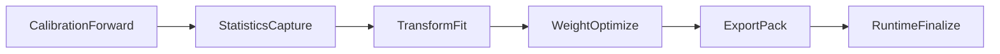
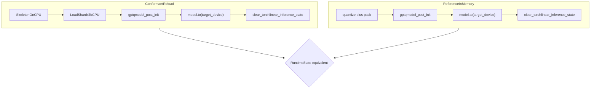

# TPQuant Protocol

## Overview

**TPQuant** (Tensor Pipeline Quantization) is the stage/rule configuration and artifact contract for post-training quantization in GPT-QModel. It supersedes [`quantization_protocol.md`](quantization_protocol.md) for new work; the older document remains a historical reference.

TPQuant is designed to be:

- clean and concise for humans
- pipeline / stage based, with explicit separation of statistics capture, transforms, quantizers, export, and runtime materialization
- explicit about matching and override behavior
- flexible about quantization method vs exported representation
- auditable at save time so in-memory and reloaded inference paths cannot silently diverge

The user-facing protocol root is intentionally shallow:

- `version`
- `stages`

It may be authored through:

- a Python DSL
- YAML / JSON serialization of the same protocol

The Python and YAML forms below describe the same protocol. Python is the ergonomic builder API. YAML is the portable serialized form.

### Relationship to the implementation

The reference PTQ engine today lives under `gptqmodel/ptq/` and is driven by `SequentialPTQProcessor` during `quantize()`. Checkpoints are written by `save_quantized()` and loaded by `from_quantized()` in the loader. This document specifies the **target contract**; see [Implementation conformance](#implementation-conformance) for what is implemented vs specified-only.

---

## Design goals

1. **One matching system only.** Rules match model objects. Stages do not rematch. Actions do not rematch the whole model in normal use.

2. **Separate pipeline stages explicitly.** Statistics capture, weight/activation transforms, weight optimization (quantizers), export packing, and runtime finalize are distinct protocol sections with distinct backends.

3. **Keep the common case short.** The common weight-only GPTQ case should need only:
   - `match`
   - `capture` (or inherit global defaults)
   - `transform` (default identity)
   - `quantize`
   - `export`

4. **Generalize calibration beyond Hessian naming.** The protocol speaks in terms of **activation statistics capture** (`StatisticsCollector` / `ModuleCalibContext`). GPTQ's Hessian is one consumer of captured moments, not the name of the capture stage itself.

5. **Separate quantization from representation.** `quantize` answers how quantized values are produced. `export` answers how those values are encoded into checkpoint tensors and runtime kernels.

6. **Make reload deterministic.** Algorithm config (`quantization_config`) and runtime materialization (`tpquant_manifest.json`) are separate layers. Reload follows a single normative placement contract so pre-reload (in-memory) and post-reload (from disk) produce equivalent `RuntimeState`.

7. **Keep backend-specific terms internal.** User-facing config uses `transform`, `quantize`, and `export`. Internal names such as `qweight`, `TorchLinear`, or `AlignDevicesHook` belong in implementation notes and manifests, not in primary authoring examples.

### Non-goals (v3 spec)

- First-class shipped configs for `input`, `output`, and `kv_cache` quantization (reserved tensor targets only).
- Persisting full activation statistics in standard artifacts (optional debug bundles only).
- Mandating a specific inference backend (Torch, Marlin, Triton) in the protocol root; that remains under `export.impl`.

---

## Terminology migration

| Old (`quantization_protocol.md`) | TPQuant |
|----------------------------------|---------|
| Implicit Hessian / calibration mixed into `prepare` | **`capture`** — activation statistics |
| `weight.prepare` (transforms + implicit stats) | **`transform`** — weight/activation transforms only |
| `weight.quantize` | **`quantize`** — weight optimizer (GPTQ, RTN, ParoQuant, …) |
| `weight.export` | **`export`** — packed runtime representation |
| (missing) | **`runtime`** — inference-ready materialization contract |
| `HessianAccumulator` (internal) | **`StatisticsCollector`** / `LayerStatistics` |

---

## Protocol root

Python:

```python
version = 3

stages = [
    Stage(
        name="ptq",
        rules=[
            Rule(
                match="*",
                weight={
                    "capture": activation_moments(factorization="cholesky"),
                    "transform": [identity()],
                    "quantize": gptq(bits=4, sym=True, group_size=128),
                    "export": {"format": "gptq_v2", "impl": "torch"},
                },
            ),
        ],
    ),
]
```

YAML:

```yaml
version: 3
stages:
  - name: ptq
    rules:
      - match: "*"
        weight:
          capture:
            method: activation_moments
            factorization: cholesky
          transform:
            - method: identity
          quantize:
            method: gptq
            bits: 4
            sym: true
            group_size: 128
          export:
            format: gptq_v2
            impl: torch
```

A **stage** is an ordered execution boundary (calibration replay scope, save/emit boundary).

A **rule** is the only normal matcher. Each rule may configure one or more tensor targets.

### Tensor targets

Supported in the schema (v3):

| Target | Status |
|--------|--------|
| `weight` | First-class |
| `input` | Reserved |
| `output` | Reserved |
| `kv_cache` | Reserved |

Each target may define up to five sections:

| Section | Purpose |
|---------|---------|
| `capture` | Activation statistics during calibration forwards |
| `transform` | Ordered list of transform steps before quantize |
| `quantize` | Weight optimizer selection and hyperparameters |
| `export` | Checkpoint layout and inference kernel family |
| `runtime` | Optional per-target overrides of global materialization (spec-only until loader adopts manifest) |

YAML shape:

```yaml
weight:
  capture: {...}       # optional; required when quantizer requires calibration
  transform: [...]     # optional; default [identity]
  quantize: {...}      # required for quantized targets
  export: {...}        # required for persisted artifacts
  runtime: {...}       # optional
```

---

## Match selectors

`Rule.match` may be either:

- a single selector string
- a list of selector strings

Selector prefixes:

- no prefix or `+:` means positive/include
- `-:` means negative/exclude

Recommended semantics:

- a rule matches if at least one positive selector matches
- any matching negative selector removes that module from the rule
- `*` is a special match-all shorthand
- every other selector string is interpreted as regex by default
- for exact module-name matches, use an anchored escaped regex such as `^model\.layers\.0\.self_attn\.q_proj$`

Python:

```yaml
- match:
    - "*"
    - "-:.*layer2.*"
  weight:
    quantize:
      method: gptq
      bits: 4
```

---

## Per-module execution pipeline

TPQuant uses **sequential PTQ** semantics (Chen et al.): calibration forwards run on a graph where earlier modules in the same layer may already be quantized. Statistics for module *W* reflect activations **after** prior modules in the layer have been updated—not a batch pass over pristine FP16 weights followed by a separate quantize pass.



### Stage order within one linear module

1. **Capture** — forward hooks accumulate a `ModuleCalibContext` via `StatisticsCollector`. Ephemeral; not written to standard artifacts.

2. **Transform** — `TransformBackend.fit` learns transform state; may bake into weights (`bake_weights: true`) and/or rotate captured statistics (`transform_hessian`). Produces `TransformState` and optional `InferenceTransformData` for online activation transforms (`T_X`).

3. **Quantize** — `WeightOptimizerBackend.optimize` consumes context + (possibly transformed) float weights. Produces `WeightQuantState` (scales, zeros, g_idx, pack_weight, extras).

4. **Export** — `ExportBackend.pack_module` replaces FP16 linears with packed runtime modules (e.g. `TorchLinear`), persists `ptq_*` buffers when inference transforms are non-identity, and registers activation pre-hooks when transforms are not fully baked.

5. **Runtime finalize** — `gptqmodel_post_init` on the in-memory graph: v1→v2 qzeros fixup, per-module `post_init`, buffer device sync, PTQ hook rehydration, cache clears. This is the **reference** inference-ready state before the first eval forward.

### Transform is not quantize

| Concern | Protocol section | Backend protocol |
|---------|------------------|------------------|
| Rotation / incoherence / ParoQuant prep | `transform` | `TransformBackend` |
| GPTQ / RTN / ParoQuant weight solve | `quantize` | `WeightOptimizerBackend` |
| Packed tensor layout | `export` | `ExportBackend` |

**Identity GPTQ example:** `transform: [identity]`, `quantize: gptq(...)`. No `ptq_*` checkpoint buffers, no inference activation hooks.

**Random orthogonal example:** `transform: [random_orthogonal(...)]`, `quantize: gptq(...)`, export persists `ptq_t_x_matrices` and rehydrates hooks at runtime finalize even when weights are baked.

### Registered backends (reference)

**Transforms** (`gptqmodel/ptq/transforms/registry.py`):

- `identity`, `none`
- `random_orthogonal`, `rand_ortho`, `quip_incoherence`
- `paroquant`, `paro`
- `wush`

**Weight optimizers** (`gptqmodel/ptq/optimizers/registry.py`):

- `gptq`, `gptaq`, `foem` → calibration required
- `paroquant`, `paro` → calibration required
- `rtn` → calibration not required

**Export** (`gptqmodel/ptq/export/registry.py`):

- `gptq`, `gptq_v2`, format-specific backends (Marlin, etc. via `export.impl`)

---

## Statistics capture

Statistics capture replaces Hessian-centric protocol wording. The implementation class is `StatisticsCollector` (alias `HessianAccumulator` for backward compatibility). Its output is folded into `ModuleCalibContext` (alias `LayerStatistics`).

### What capture accumulates

`StatisticsCollector` streams activation rows during calibration forwards without materializing the full activation matrix:

| Field | Role |
|-------|------|
| `nsamples` | Observed activation row count for this module |
| `H` | Gram matrix / second moment (when factorization is `cholesky`) |
| `qr_R` | QR factor of activations (when factorization is `qr`) |
| `row_buffer` | Bounded row store for transform optimization |
| `block_M_W`, `block_M_X` | Optional block statistics for advanced transforms |

After quantizer prep, the context may also hold `H_inv`, `damp` (GPTQ-specific derived state). These remain **downstream of capture** in the quantizer backend, not part of the capture config itself.

### Capture configuration

Protocol YAML (maps to `HessianConfig` in current `QuantizeConfig.hessian`):

```yaml
capture:
  method: activation_moments
  factorization: cholesky    # cholesky | qr
  row_buffer_max_rows: 2048
  staging_dtype: auto        # auto | float32 | bfloat16
  chunk_policy: ...          # implementation-specific; optional
```

Python:

```python
capture=activation_moments(
    factorization="cholesky",
    row_buffer_max_rows=2048,
)
```

### Quantizer calibration requirements

| `quantize.method` | Requires `capture`? |
|-------------------|---------------------|
| `gptq`, `gptaq`, `foem` | Yes |
| `paroquant` | Yes |
| `rtn` | No |

Transforms may read `row_buffer` and `H` independently of which quantizer runs afterward.

### Ephemeral by default

Standard artifacts **must not** include full `H` or `row_buffer` tensors. Optional debug bundles (`statistics_debug/` sidecar) may be emitted when `debug.capture_dump: true` (spec-only flag; not implemented in writer today).

---

## Transform section

`transform` is an **ordered list** of transform steps applied to one module before quantize.

```yaml
transform:
  - method: identity
    bake_weights: true
  - method: random_orthogonal
    mode: standalone
    bake_weights: true
    group_size: 128
    opt_seed: 42
```

Fields:

| Field | Meaning |
|-------|---------|
| `method` | Transform backend id |
| `mode` | `standalone` or `e2e` |
| `bake_weights` | If true, apply transform to stored weights offline |
| `options` | Method-specific kwargs (merged with global quant hyperparams in the pipeline) |

Outputs:

- **`TransformState`** — offline parameters, payload, bake flag
- **`InferenceTransformData`** — kernel-facing `T_X` metadata when activation transforms must run at inference to preserve the bilinear inner product

Identity transforms are zero-cost: no checkpoint buffers, no forward pre-hooks, no manifest `ptq_inference` entries.

---

## Quantize section

`quantize` selects the weight optimizer and its hyperparameters.

```yaml
quantize:
  method: gptq
  bits: 4
  sym: true
  group_size: 128
  desc_act: false
  damp_percent: 0.01
  statistics:              # optional per-module override of capture
    factorization: qr
```

Output **`WeightQuantState`**: `q_scales`, `qzeros`, `q_g_idx`, optional `pack_weight`, and method-specific `extra` (e.g. GPTQ loss, damp).

The quantizer **must not** perform export packing; packing is always export's responsibility.

---

## Export section

`export` defines how `WeightQuantState` and transform metadata become checkpoint tensors and runtime module types.

```yaml
export:
  format: gptq_v2
  impl: torch
  options: {}
```

Responsibilities:

- Choose packed layout (`gptq`, `gptq_v2`, Marlin, …)
- Name tensors in safetensors shards
- Persist `ptq_*` buffers when `InferenceTransformData` is non-identity
- Record export metadata in `quantization_config` and `tpquant_manifest.json`

Export does **not** rerun calibration or re-optimize weights.

---

## Runtime section

`runtime` describes how a loaded artifact becomes inference-ready. For v3 artifacts this is primarily expressed globally in `tpquant_manifest.json`; per-rule `runtime` overrides are optional.

```yaml
runtime:
  placement_contract: cpu_staged_post_init_single_move
  target_device: cuda:0
  strict_roundtrip: true
```

Spec-only until loader conformance is implemented. See [Runtime materialization](#runtime-materialization) and [Artifact layout](#artifact-layout).

---

## Stage execution semantics

Within a `ptq` stage, recommended engine order is:

1. Evaluate rules in order; resolve matches and aliases.
2. Run rule-scoped `actions` (cross-target ops such as SmoothQuant balancing).
3. For each matched module in layer order:
   - run calibration forwards with capture hooks enabled
   - finalize capture → `ModuleCalibContext`
   - run `transform` chain
   - run `quantize`
   - run `export` (pack module)
4. Run global **runtime finalize** once on the full model (`gptqmodel_post_init`).
5. Optionally run **save-time self-test** (strict mode).
6. Emit checkpoint files and `tpquant_manifest.json`.

Actions remain for rule-scoped behavior. Local module prep belongs in `transform`, not in `actions`.

---

## Artifact layout

TPQuant checkpoints separate **algorithm configuration** from **runtime materialization**.

### Layer 1: Algorithm config (existing, retained)

| File | Contents |
|------|----------|
| `config.json` | HF model config; embeds `quantization_config` |
| `quantize_config.json` / nested config | Bits, group size, damp, transform/quantizer/export summaries |
| `model*.safetensors` | Tensor payloads |
| Tokenizer / processor sidecars | Unchanged |

`quantization_config` answers: *how was this model quantized?*

It must **not** encode device placement, hook dispatch, or post-init ordering—these belong in the manifest.

### Layer 2: `tpquant_manifest.json` (required for v3 artifacts)

New file at checkpoint root. Answers: *how must this artifact be materialized for inference?*

```yaml
protocol_version: 3
gptqmodel_version: "…"
export_format: gptq_v2
placement_contract: cpu_staged_post_init_single_move
target_device: cuda:0
post_init_sequence:
  - v1_to_v2_runtime
  - quant_linear_post_init
  - sync_quant_buffers
  - rehydrate_ptq_hooks
  - clear_linear_caches
tied_weights:
  lm_head.weight: model.embed_tokens.weight
transform_summary:
  model.layers.0.self_attn.q_proj: identity
  # … per quantized module, or "identity"
tensor_inventory:
  model.embed_tokens.weight:
    role: fp16_passthrough
    dtype: float16
    shape: [151936, 1024]
    checksum: sha256:…
  model.layers.0.self_attn.q_proj.qweight:
    role: quantized_packed
    dtype: int32
    shape: […]
    checksum: sha256:…
  model.layers.0.self_attn.q_proj.ptq_t_x_matrices:
    role: ptq_inference
    present: false
self_test:
  reference_prompt_hash: sha256:…
  logits_mean_rel_error: 0.002
  ppl_ratio: 1.01
  passed: true
```

#### Manifest fields

| Field | Purpose |
|-------|---------|
| `protocol_version` | Must be `3` for TPQuant artifacts |
| `gptqmodel_version` | Producer version string |
| `export_format` | Packed layout id (`gptq_v2`, …) |
| `placement_contract` | Canonical reload recipe id |
| `target_device` | Intended single-device target when contract is single-GPU |
| `post_init_sequence` | Ordered finalize steps; must match loader behavior |
| `tensor_inventory` | Every load-bearing tensor with role, dtype, shape, checksum |
| `tied_weights` | Explicit tied parameter pairs |
| `transform_summary` | Per-module transform method or `identity` |
| `self_test` | Save-time round-trip fingerprint (strict mode) |

#### Tensor inventory roles

| Role | Examples | Audit note |
|------|----------|------------|
| `quantized_packed` | `qweight`, `scales`, `qzeros`, `g_idx` | Dequant parity tests cover these today |
| `fp16_passthrough` | `embed_tokens`, `norm`, `rotary_emb` | **Required listing**; embed divergence appeared here while packed weights matched |
| `ptq_inference` | `ptq_t_x_matrices`, `ptq_transform_method_bytes` | Absent for identity transforms |
| `tied_alias` | `lm_head.weight` → canonical embed storage | No duplicate shard entry |

Checksums use SHA-256 over raw tensor bytes at save time. Reload must verify `fp16_passthrough` and `quantized_packed` entries match inventory before declaring materialization successful.

---

## Runtime materialization

### Problem statement (audit-driven)

Observed failure mode on identity GPTQ reload (e.g. Qwen3-0.6B):

- In-memory after `quantize()`: healthy PPL (~23).
- After `save` + standard reload: PPL ≈ vocab size (random logits).
- Packed weight dequant matches in-memory; isolated TorchLinear forward matches dequant.
- Full-graph hidden states diverge at **`model.embed_tokens`** (first probe).
- Ablation of hooks, second `.to()`, and CPU mirror load did **not** restore logits—corruption is tied to reload/materialization, not placement alone.

Pre-reload graphs lack `hf_device_map`; post-reload graphs always acquire one (layerwise or flat). TPQuant treats **equivalent `RuntimeState`** as a first-class requirement, not an implementation detail.

### `RuntimeState` (normative concept)

Two materialization paths are equivalent when they produce the same `RuntimeState`:

| Property | Single-GPU conformant value |
|----------|----------------------------|
| Parameter devices | All on `target_device` |
| Quant buffer devices | Synced with parent modules |
| `hf_device_map` | Absent, or manifest-declared only |
| Accelerate hook count | 0 |
| TorchLinear compile flags | Match manifest / env |
| Tied weight aliasing | Matches `tied_weights` in manifest |
| Activation pre-hooks | Only those declared in `transform_summary` |

### Placement contract: `cpu_staged_post_init_single_move`

**Normative reload algorithm** for single-GPU conformant artifacts:

```
1. Build model skeleton (empty quant shells via make_quant)
2. Load ALL checkpoint tensors to CPU (device_map={"": "cpu"} or equivalent)
3. Load ptq_inference buffers from shards if present
4. tie_weights() before and after checkpoint load
5. gptqmodel_post_init(model) on CPU
6. Single model.to(target_device) — no AlignDevicesHook
7. clear_torchlinear_inference_state(model)
8. Inference / eval
```



#### Forbidden for single-GPU conformant artifacts

- GPU-side `load_checkpoint_in_model` **before** `post_init`
- Layerwise `AlignDevicesHook` dispatch on a single GPU
- Implicit second `model.to()` during eval prep without manifest acknowledgment
- Relying on dequant-only linear tests as sole save verification (misses embed/norm/rotary)

#### Multi-GPU

Use `placement_contract: multi_device_dispatch` with an explicit `device_map` recorded in the manifest. Hook-based dispatch may be used, but the manifest must declare hook count expectations and per-module device assignments.

### Placement contract: `multi_device_dispatch`

For multi-GPU artifacts:

```
1. Skeleton + CPU or direct shard load per manifest device_map
2. tie_weights before/after load
3. gptqmodel_post_init
4. Declared dispatch (accelerate hooks or documented alternative)
5. clear_torchlinear_inference_state on affected modules
```

Manifest must include full `device_map` and expected `align_devices_hook_count`.

---

## Save-time verification

### Strict round-trip mode

When `runtime.strict_roundtrip: true` (or save flag `--strict-roundtrip`):

1. After writing safetensors and manifest, reload in-process using **only** the manifest placement contract.
2. Run **SelfTest** with a fixed `reference_prompt` (hashed and stored in manifest).
3. Compare logits fingerprint to the pre-save in-memory model.
4. **Fail the save** if:
   - `logits_mean_rel_error > threshold` (default 0.05), or
   - `ppl_ratio > bound` (default 1.25× in-memory PPL)
5. Write `self_test` results into manifest (`passed`, errors, metrics).

SelfTest must exercise **full model forward**, not isolated linear dequant tests.

### Inventory verification on reload

Loader must verify checksums for:

- All `fp16_passthrough` tensors in `tensor_inventory`
- All `quantized_packed` tensors

Mismatch aborts load with a manifest error identifying the first diverged tensor name.

---

## Examples

### Example 1: Identity GPTQ (Qwen3-class)

```yaml
version: 3
stages:
  - name: ptq
    rules:
      - match: "*"
        weight:
          capture:
            method: activation_moments
            factorization: cholesky
            row_buffer_max_rows: 512
          transform:
            - method: identity
              bake_weights: true
          quantize:
            method: gptq
            bits: 4
            sym: true
            group_size: 128
            desc_act: false
            damp_percent: 0.01
          export:
            format: gptq_v2
            impl: torch
        runtime:
          placement_contract: cpu_staged_post_init_single_move
          target_device: cuda:0
          strict_roundtrip: true
```

Manifest excerpt (identity — no `ptq_inference` entries):

```yaml
transform_summary:
  "model.layers.0.self_attn.q_proj": identity
tensor_inventory:
  model.embed_tokens.weight:
    role: fp16_passthrough
    dtype: float16
    checksum: sha256:…
post_init_sequence:
  - v1_to_v2_runtime
  - quant_linear_post_init
  - sync_quant_buffers
  - clear_linear_caches
```

Note: `rehydrate_ptq_hooks` omitted when all transforms are identity.

### Example 2: Random orthogonal + GPTQ

```yaml
version: 3
stages:
  - name: ptq
    rules:
      - match: "*"
        weight:
          capture:
            method: activation_moments
            factorization: cholesky
          transform:
            - method: random_orthogonal
              bake_weights: true
              group_size: 128
              opt_seed: 42
          quantize:
            method: gptq
            bits: 4
            sym: true
            group_size: 128
          export:
            format: gptq_v2
            impl: torch
```

Manifest adds `ptq_inference` inventory entries and includes `rehydrate_ptq_hooks` in `post_init_sequence`.

### Example 3: Rule override (layer 0 QKV)

```yaml
version: 3
stages:
  - name: ptq
    rules:
      - match: "^model\\.layers\\.0\\.self_attn\\.(q|k|v)_proj$"
        stop: true
        weight:
          quantize:
            method: gptq
            bits: 8
            sym: true
            group_size: 128
          export:
            format: gptq_v2
            impl: torch
      - match: "*"
        weight:
          capture:
            method: activation_moments
            factorization: cholesky
          transform:
            - method: identity
          quantize:
            method: gptq
            bits: 4
            sym: true
            group_size: 128
          export:
            format: gptq_v2
            impl: torch
```

`stop: true` prevents later rules from modifying matched modules.

---

## Mapping from `QuantizeConfig`

Current Python API fields map to TPQuant YAML as follows:

| `QuantizeConfig` / legacy field | TPQuant section | Notes |
|--------------------------------|-----------------|-------|
| `weight_prepare` | `transform` | List of transform steps |
| `weight_quantize` | `quantize` | Includes `method` |
| `weight_export` | `export` | Includes `format`, `impl` |
| `hessian` | `capture.statistics` | Renamed conceptually to activation moments |
| `bits`, `sym`, `group_size`, `desc_act` | `quantize.*` | Quantizer hyperparameters |
| `damp_percent`, `damp_auto_increment` | `quantize.*` | GPTQ-specific |
| `format` / `method` (top-level) | `export.format` + quantizer method | Split explicitly in v3 |
| (none) | `runtime.placement_contract` | New; manifest-backed |
| ParoQuant `opt_*` fields | `transform[].options` when method is paroquant | Not separate quantizer |

Backward compatibility: parsers may accept v2-style `weight.prepare` as an alias for `transform` during transition.

---

## Implementation conformance

Honest status as of the TPQuant v3 spec authoring. **Specified** items are normative; **partial** items exist in code but do not fully meet the spec.

| Spec item | Status |
|-----------|--------|
| capture → transform → quantize → export pipeline in PTQ code | **Implemented** (`SequentialPTQProcessor`, `ModuleQuantizationPipeline`) |
| `StatisticsCollector` / `ModuleCalibContext` | **Implemented** |
| Transform / quantizer / export backend registries | **Implemented** |
| Identity transform zero-cost path | **Implemented** |
| PTQ inference buffer save/load | **Implemented** (`persist_ptq_inference_buffers`, `load_ptq_inference_buffers_from_checkpoint`) |
| `tpquant_manifest.json` writer | **Spec only** |
| `tpquant_manifest.json` loader enforcement | **Spec only** |
| `cpu_staged_post_init_single_move` as default reload | **Partial** (audit utility `reload_gptq_checkpoint_mirror_pre_reload`; production loader still uses `simple_dispatch_model`) |
| Save-time `strict_roundtrip` SelfTest | **Spec only** |
| `fp16_passthrough` tensor inventory checksums | **Spec only** |
| Forbidden-pattern enforcement (no hooks single GPU) | **Spec only** |
| `runtime` per-rule overrides in loader | **Spec only** |

### Recommended implementation order

1. Emit `tpquant_manifest.json` from `save_quantized()` with `tensor_inventory` including embed/norm/rotary.
2. Teach loader to read manifest and follow `placement_contract` (single path for single GPU).
3. Add optional strict round-trip SelfTest at end of save.
4. Deprecate reload paths that skip manifest or use GPU pre-init load for conformant artifacts.

Until steps 1–2 land, producers should treat in-memory post-quantize inference as the reference path and treat standard reload as **potentially non-equivalent** unless SelfTest passes.

---

## Internal compilation model

Implementations may compile user-facing TPQuant YAML into internal typed objects:

```python
Plan(version=3, stages=[Stage(name="ptq", rules=[...])])
```

Module-level runtime objects mirror existing code:

- `TransformPrepareConfig` → transform steps
- `WeightQuantizeTargetConfig` → quantize
- `ExportTargetConfig` → export
- `RuntimeTargetConfig` → runtime (spec-only dataclass; not yet in `gptqmodel/ptq/config.py`)

The internal plan object is for parser/runtime organization. User configs remain a single protocol root per quantization run or artifact.

---

## Summary

TPQuant v3 separates **what** was done to weights (`capture`, `transform`, `quantize`, `export`) from **how** checkpoints must be loaded (`tpquant_manifest.json`, placement contracts, inventory checksums, SelfTest). That separation directly addresses pre vs post-reload divergence observed when packed linear weights match but full-graph activations do not: the protocol requires verifying and materializing **all** load-bearing tensors—including FP16 passthrough modules—not only quantized linears.
